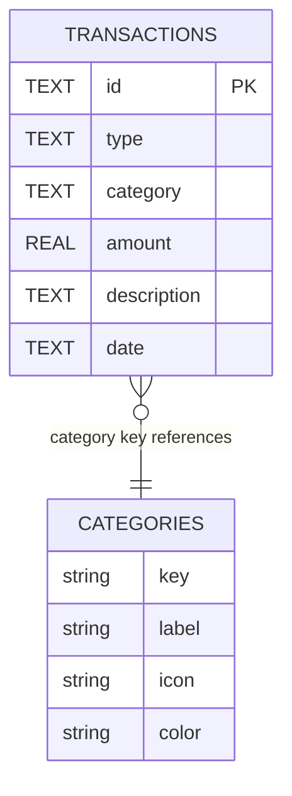

# FinDash Data Model

This document describes the domain types, SQLite schema, and category system used by FinDash.

---

## Overview

FinDash stores **transactions** locally in a SQLite database (`findex.db`). Categories are **not** stored in the database — they are defined as a static registry and referenced by key on each transaction.



---

## SQLite schema

**Database file:** `findex.db` (opened via `expo-sqlite`)

**Table:** `transactions`

| Column | Type | Constraints | Description |
|--------|------|-------------|-------------|
| `id` | TEXT | PRIMARY KEY | UUID generated with `expo-crypto` |
| `type` | TEXT | NOT NULL | `"Income"` or `"Expense"` |
| `category` | TEXT | NOT NULL | Category key (see below) |
| `amount` | REAL | NOT NULL | Positive numeric value |
| `description` | TEXT | nullable | Free-text note |
| `date` | TEXT | NOT NULL | ISO 8601 date string |

### DDL

Created in `src/services/db/transactions.ts` on app startup:

```sql
CREATE TABLE IF NOT EXISTS transactions (
  id TEXT PRIMARY KEY,
  type TEXT NOT NULL,
  category TEXT NOT NULL,
  amount REAL NOT NULL,
  description TEXT,
  date TEXT NOT NULL
);
```

### Operations

| Function | File | Description |
|----------|------|-------------|
| `initDB()` | `services/db/transactions.ts` | Creates table if missing |
| `addTransaction(tx)` | `services/db/transactions.ts` | INSERT new row |
| `getTransactions()` | `services/db/transactions.ts` | SELECT all, ordered by `date DESC` |
| `deleteTransaction(id)` | `services/db/transactions.ts` | DELETE by id (not yet used in UI) |
| `saveTransaction(tx)` | `services/transactions.ts` | Facade over `addTransaction` |
| `getAllTransactions()` | `services/transactions.ts` | Facade over `getTransactions` |

---

## TypeScript types

### `TransactionDb` (persistence)

Defined in `src/types/Transaction.ts`. Matches the SQLite row shape exactly.

```typescript
type TransactionDb = {
  id: string;
  type: string;           // "Income" | "Expense"
  category: string;       // CategoryType key
  amount: number;
  description: string;
  date: string;           // ISO string, e.g. "2026-07-06T12:00:00.000Z"
};
```

### `TransactionType` (presentation)

UI-enriched transaction used by list and detail components.

```typescript
type TransactionType = {
  id: string;
  iconName: keyof typeof Ionicons.glyphMap;
  type: "Expense" | "Income";
  category: string;
  amount: number;
  description: string;
  date: Date;             // Parsed from ISO string
  color?: string;         // From Categories registry
};
```

### Mapping DB → UI

`HomeScreen` performs this transformation when loading recent transactions:

1. Fetch `TransactionDb[]` from the service layer
2. Look up `Categories[category]` for icon and color
3. Parse `date` string into a `Date` object
4. Pass `TransactionType[]` to `TransactionList`

---

## Categories

Categories are defined in `src/services/categories.ts` as a static `Record<CategoryType, {...}>`.

### `CategoryType` union

```typescript
type CategoryType =
  | "Food"
  | "Transport"
  | "Shopping"
  | "Bills"
  | "Entertainment"
  | "HealthCare"
  | "Education"
  | "Other"
  | "Income";
```

### Registry

| Key | Label | Icon | Color |
|-----|-------|------|-------|
| Food | Food & Dining | fast-food | `#FF7043` |
| Transport | Transport | car | `#42A5F5` |
| Shopping | Shopping | cart | `#AB47BC` |
| Bills | Bills & Utilities | flash | `#FFA726` |
| Entertainment | Entertainment | game-controller | `#26C6DA` |
| HealthCare | HealthCare | fitness | `#EF5350` |
| Education | Education | school | `#66BB6A` |
| Other | Other Expense | ellipsis-horizontal | `#BDBDBD` |
| Income | Income | cash | `#90EE90` |

### Category selection rules

In `AddTransactionScreen`:

- **Expense** — user picks from all categories except Income is included in dropdown (Income is in the registry but expense dropdown maps all entries)
- **Income** — category is auto-set to `"Income"` and the category dropdown is disabled

---

## Derived metrics

Computed client-side in `HomeScreen` from the full transaction list:

| Metric | Formula |
|--------|---------|
| Total Income | Sum of `amount` where `type === "Income"` |
| Total Expenses | Sum of `amount` where `type === "Expense"` |
| Total Balance | `totalIncome - totalExpenses` |
| Savings Rate | `totalBalance / (totalIncome / 100)` (percentage) |

These calculations will eventually move to `utils/calculateStats.ts` and/or `useStats` hook.

### Planned stats types

`src/types/Stats.ts` is reserved for structured chart/report payloads, for example:

- Monthly income vs expense series (for `IncomeExpenseChart`)
- Category breakdown with amounts and percentages (for `CategoryPieChart`)
- Period-over-period change percentages (for summary card descriptions)

---

## Validation rules

Current validation in `AddTransactionScreen` (client-side only):

| Field | Rule |
|-------|------|
| Type | Required |
| Category | Required (auto-filled for Income) |
| Amount | Required, coerced with `Number()` |
| Description | Optional |
| Date | Defaults to today |

No server-side or DB-level constraints beyond NOT NULL columns. Negative amounts are not explicitly blocked.

---

## Future considerations

- **Update transaction** — requires `UPDATE` SQL and edit UI in `TransactionDetailsScreen`
- **Custom categories** — would need a `categories` table or user preferences storage
- **Multi-currency** — amount storage may need a `currency` column or user default in settings
- **Soft delete / archiving** — optional `deleted_at` column
- **Indexes** — `CREATE INDEX idx_transactions_date ON transactions(date)` for large datasets
