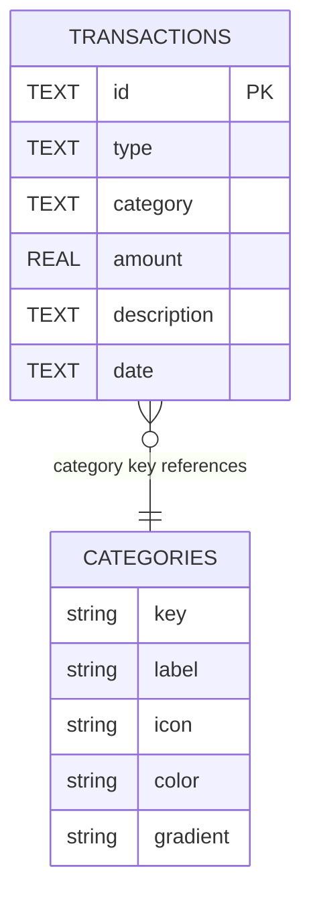

# FinDash Data Model

This document describes the current domain types, SQLite schema, and category system used by FinDash.

---

## Overview

FinDash stores transactions locally in a SQLite database named findex.db. Categories are not stored in the database; they are defined as a static registry and referenced by key on each transaction.



---

## SQLite schema

Database file: findex.db

Table: transactions

| Column      | Type | Constraints | Description                     |
| ----------- | ---- | ----------- | ------------------------------- |
| id          | TEXT | PRIMARY KEY | UUID generated with expo-crypto |
| type        | TEXT | NOT NULL    | "Income" or "Expense"           |
| category    | TEXT | NOT NULL    | Category key                    |
| amount      | REAL | NOT NULL    | Numeric value                   |
| description | TEXT | nullable    | Free-text note                  |
| date        | TEXT | NOT NULL    | ISO 8601 date string            |

### DDL

The table is created on startup in src/services/db/transactions.ts:

```sql
CREATE TABLE IF NOT EXISTS transactions (
  id TEXT PRIMARY KEY,
  type TEXT NOT NULL,
  category TEXT NOT NULL,
  amount REAL NOT NULL,
  description TEXT,
  date TEXT NOT NULL
);
```

### Operations

| Function              | File                            | Description                                  |
| --------------------- | ------------------------------- | -------------------------------------------- |
| initDB()              | src/services/db/transactions.ts | Creates the table if it does not exist       |
| addTransaction(tx)    | src/services/db/transactions.ts | Inserts a new row                            |
| getTransactions()     | src/services/db/transactions.ts | Retrieves all rows sorted by date descending |
| deleteTransaction(id) | src/services/db/transactions.ts | Deletes a row by id                          |
| saveTransaction(tx)   | src/services/transactions.ts    | Facade for inserting a transaction           |
| getAllTransactions()  | src/services/transactions.ts    | Facade for loading transactions              |

---

## TypeScript types

### TransactionDb (persistence)

Defined in src/types/Transaction.ts and matches the SQLite row shape:

```typescript
type TransactionDb = {
  id: string;
  type: string;
  category: string;
  amount: number;
  description: string;
  date: string;
};
```

### TransactionType (presentation)

The UI layer uses a richer shape for rendering:

```typescript
type TransactionType = {
  id: string;
  iconName: keyof typeof Ionicons.glyphMap;
  type: "Expense" | "Income";
  category: string;
  amount: number;
  description: string;
  date: Date;
  color?: string;
};
```

### Mapping DB → UI

HomeScreen currently transforms persisted rows into UI transaction objects by:

1. Reading the stored TransactionDb items
2. Looking up the category metadata for icon/color values
3. Parsing the ISO date string into a Date
4. Passing the result to the transaction list UI

---

## Categories

Categories are defined in src/services/categories.ts as a static registry keyed by CategoryType.

### CategoryType union

```typescript
type CategoryType =
  | "Food"
  | "Transport"
  | "Shopping"
  | "Bills"
  | "Entertainment"
  | "HealthCare"
  | "Education"
  | "Other"
  | "Income";
```

### Registry

| Key           | Label             | Icon                | Color   | Gradient |
| ------------- | ----------------- | ------------------- | ------- | -------- |
| Food          | Food & Dining     | fast-food           | #FF7043 | #D84315  |
| Transport     | Transport         | car                 | #42A5F5 | #1E88E5  |
| Shopping      | Shopping          | cart                | #AB47BC | #8E24AA  |
| Bills         | Bills & Utilities | flash               | #FFA726 | #FB8C00  |
| Entertainment | Entertainment     | game-controller     | #26C6DA | #00ACC1  |
| HealthCare    | HealthCare        | fitness             | #EF5350 | #D32F2F  |
| Education     | Education         | school              | #66BB6A | #43A047  |
| Other         | Other Expense     | ellipsis-horizontal | #BDBDBD | #9E9E9E  |
| Income        | Income            | cash                | #90EE90 | #66BB6A  |

### Category selection rules

In AddTransactionScreen:

- Expense transactions use the full category list except that Income is also present in the registry.
- Income transactions automatically set the category to "Income" and disable the category picker.

---

## Derived metrics

The home screen computes these values from the full transaction list:

| Metric         | Formula                               |
| -------------- | ------------------------------------- |
| Total Income   | Sum of amount where type is "Income"  |
| Total Expenses | Sum of amount where type is "Expense" |
| Total Balance  | Total Income - Total Expenses         |
| Savings Rate   | Total Balance / (Total Income / 100)  |

These calculations are currently done in HomeScreen rather than in a shared utility module.

---

## Validation rules

The current input validation is client-side and happens in AddTransactionScreen:

| Field       | Rule                                 |
| ----------- | ------------------------------------ |
| Type        | Required                             |
| Category    | Required, auto-filled for income     |
| Amount      | Required and converted with Number() |
| Description | Optional                             |
| Date        | Defaults to the current date         |

There are no server-side or database-level constraints beyond the table schema itself.

---

## Future considerations

- Add update transaction support with an UPDATE SQL statement and UI changes
- Support custom categories through a categories table or user preferences
- Add multi-currency support if the app needs more than one currency
- Add soft delete or archive behavior for old transactions
- Introduce indexes for larger datasets if transaction volume grows
