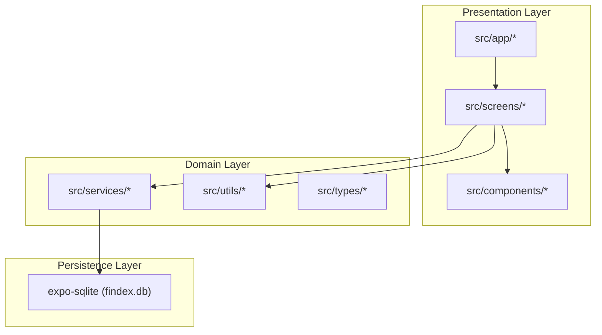
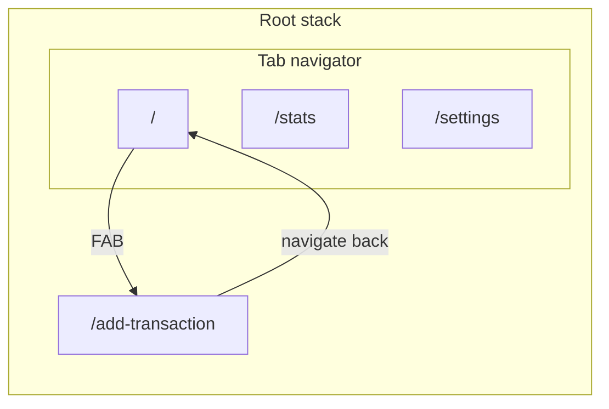
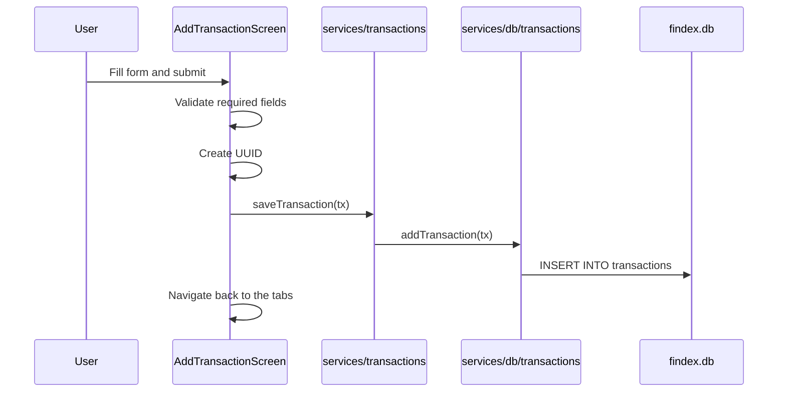
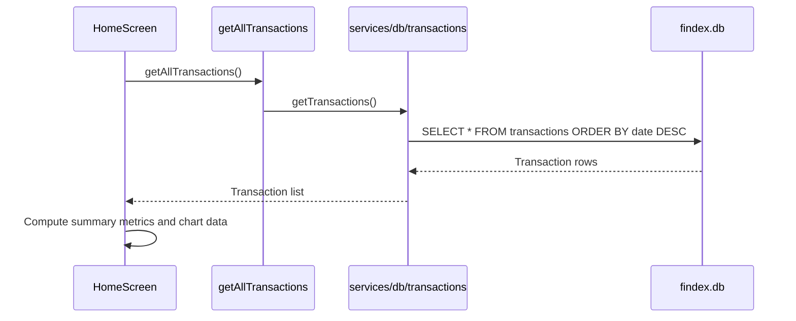

# FinDash Project Architecture

FinDash is a cross-platform personal finance tracker built with Expo, React Native, and expo-router. It currently supports transaction entry, a dashboard with summary cards and charts, and local persistence in SQLite.

This document explains how the codebase is structured today and where the implementation still has room to grow.

---

## Table of contents

1. [High-level overview](#high-level-overview)
2. [Technology stack](#technology-stack)
3. [Directory structure](#directory-structure)
4. [Application layers](#application-layers)
5. [Navigation and routing](#navigation-and-routing)
6. [Data flow](#data-flow)
7. [Implementation status](#implementation-status)
8. [Related documentation](#related-documentation)

---

## High-level overview

The app uses a layered structure with separate routing, screen, component, service, and persistence responsibilities:



In the current build, screens call the service layer directly. The context and hook directories exist but are still scaffolding rather than a fully active state layer.

---

## Technology stack

| Layer        | Technology                                                            |
| ------------ | --------------------------------------------------------------------- |
| Framework    | Expo SDK 57, React Native 0.86, React 19.2                            |
| Navigation   | expo-router with file-based routes                                    |
| Database     | expo-sqlite (local SQLite, findex.db)                                 |
| Charts       | react-native-gifted-charts                                            |
| Icons        | @expo/vector-icons                                                    |
| Forms        | react-native-element-dropdown, @react-native-community/datetimepicker |
| IDs          | expo-crypto (randomUUID)                                              |
| Language     | TypeScript (strict)                                                   |
| Path aliases | `@/*` maps to the project root                                        |

The app config also enables typed routes and React Compiler in app.json.

---

## Directory structure

```text
FinDash/
├── assets/                  # Images and icons
├── docs/                    # Documentation
├── src/
│   ├── app/                 # expo-router routes and layouts
│   │   ├── _layout.tsx      # Root stack and DB initialization
│   │   ├── _layout.web.tsx
│   │   ├── add-transaction.tsx
│   │   └── (tabs)/
│   │       ├── _layout.tsx
│   │       ├── _layout.web.tsx
│   │       ├── index.tsx
│   │       ├── index.web.tsx
│   │       ├── home.web.css
│   │       ├── stats.tsx
│   │       └── settings.tsx
│   ├── screens/             # Home, add transaction, and placeholder screens
│   ├── components/
│   │   ├── ui/              # Shared UI elements
│   │   ├── charts/          # Income/expense and category charts
│   │   └── transactions/    # Transaction list and row rendering
│   ├── context/             # Context scaffolding
│   ├── hooks/               # Hook scaffolding
│   ├── services/
│   │   ├── db/              # Raw SQLite operations
│   │   ├── transactions.ts  # Transaction facade
│   │   └── categories.ts    # Static category registry
│   ├── types/               # Domain type definitions
│   └── utils/               # Formatting and stats helpers
├── app.json
├── package.json
└── tsconfig.json
```

---

## Application layers

### 1. Routing (`src/app`)

Routes are thin entry points that delegate to screen components and configure navigation chrome.

| Route file            | Path               | Current behavior                    |
| --------------------- | ------------------ | ----------------------------------- |
| `(tabs)/index.tsx`    | `/`                | Renders the home dashboard          |
| `(tabs)/stats.tsx`    | `/stats`           | Renders a simple placeholder screen |
| `(tabs)/settings.tsx` | `/settings`        | Renders a simple placeholder screen |
| `add-transaction.tsx` | `/add-transaction` | Renders the transaction form        |

The root layout initializes the database on app start through initDB().

### 2. Screens (`src/screens`)

| Screen                   | Status      | Responsibility                                       |
| ------------------------ | ----------- | ---------------------------------------------------- |
| HomeScreen               | Implemented | Shows summary cards, charts, and recent transactions |
| AddTransactionScreen     | Implemented | Creates a new transaction and saves it to SQLite     |
| StatsScreen              | Placeholder | Not yet a full analytics experience                  |
| SettingsScreen           | Placeholder | Not yet a settings experience                        |
| TransactionDetailsScreen | Placeholder | Not implemented                                      |

### 3. Components (`src/components`)

- ui: reusable form and layout primitives
- charts: income/expense and category charts
- transactions: transaction list and row rendering

The chart components are currently connected to live transaction data from the service layer.

### 4. Services (`src/services`)

The current data flow is:

```text
Screen -> services/transactions.ts -> services/db/transactions.ts -> SQLite
```

| Module                      | Role                                                                              |
| --------------------------- | --------------------------------------------------------------------------------- |
| services/db/transactions.ts | Low-level SQLite work: initDB, addTransaction, getTransactions, deleteTransaction |
| services/transactions.ts    | Facade over database operations for screens                                       |
| services/categories.ts      | Static category registry with label, icon, color, and gradient values             |

### 5. Types (`src/types`)

| Type            | File           | Purpose                                         |
| --------------- | -------------- | ----------------------------------------------- |
| TransactionDb   | Transaction.ts | Persistence shape stored in SQLite              |
| TransactionType | Transaction.ts | UI-friendly shape for list and detail rendering |
| CategoryType    | Category.ts    | Allowed category keys                           |
| CategorySlice   | Category.ts    | Pie-chart slice metadata                        |

### 6. Context and hooks

The directories for context and hooks exist and are intended for future state sharing, but they are not yet wired into the UI. The current implementation relies on screen-level state and direct service calls.

---

## Navigation and routing



On native platforms, the app uses bottom tabs for Home, Stats, and Settings. The add-transaction flow is a route that returns to the main tab stack.

Web has its own layout variants under src/app, including a web-specific home placeholder.

---

## Data flow

### Adding a transaction



### Loading the home dashboard



---

## Implementation status

| Feature                         | Status      | Notes                                             |
| ------------------------------- | ----------- | ------------------------------------------------- |
| Transaction entry               | Implemented | Uses expo-crypto UUIDs and saves to SQLite        |
| Home dashboard                  | Implemented | Summary cards and charts use persisted data       |
| Recent transactions             | Implemented | Shows the latest five entries                     |
| Stats screen                    | Placeholder | Basic text-only screen                            |
| Settings screen                 | Placeholder | Basic text-only screen                            |
| Transaction details/edit/delete | Planned     | DB layer already has delete support, UI not wired |
| Shared state layer              | Planned     | Context and hooks are scaffolded but not active   |

---

## Related documentation

- [README.md](../README.md)
- [DATA_MODEL.md](./DATA_MODEL.md)
- [DEVELOPMENT.md](./DEVELOPMENT.md)

  Home->>Service: getAllTransactions() on mount
  Service->>DB: SELECT \* ORDER BY date DESC
  DB-->>Home: TransactionDb[]
  Home->>Home: Compute income, expenses, balance, savings rate
  Home->>Home: Map to TransactionType with category icons/colors
  Home->>Home: Render cards, charts (demo), recent list (live)

```

**Note:** Summary card trend percentages (`12.5% from last month`) are hardcoded placeholders. Charts on Home still render demo datasets.

---

## Cross-platform strategy

| Concern | Native | Web |
|---------|--------|-----|
| Tab navigation | `@react-navigation/bottom-tabs` via expo-router | Top navbar in `_layout.web.tsx` |
| Home screen | `HomeScreen.tsx` (React Native) | `index.web.tsx` (HTML/CSS placeholder) |
| Styling | `StyleSheet` | `home.web.css` for web home; rest uses RN Web |
| SQLite | expo-sqlite (supported on web in Expo) | Same API |
| Platform files | Default `.tsx` | `.web.tsx` overrides |

Platform-specific files follow Expo's resolution order: `index.web.tsx` is used on web instead of `index.tsx` for the home tab.

---

## Implementation status

### Done

- SQLite schema and CRUD for transactions
- Home dashboard with live balance calculations from DB
- Add transaction form with validation
- Category registry with icons and colors
- Transaction list UI with formatted dates
- Reusable UI form components
- Web root layout with navigation bar

### In progress / stubbed

- Stats and Settings tab screens (inline placeholders in routes)
- Chart components (UI complete, demo data only)
- Card trend descriptions (hardcoded percentages)
- Web home page (static HTML/CSS mockup)

### Not started (scaffolding only)

- Context providers and custom hooks
- `StatsScreen`, `SettingsScreen`, `TransactionDetailsScreen`
- `formatCurrency`, `calculateStats`, `constants`
- `Stats.ts` types
- Transaction edit/delete flows
- Month-over-month comparison logic
- Currency and theme preferences

---

## Conventions and design decisions

### Route vs screen split

Keep `src/app` routes minimal — one default export that renders a screen. Navigation config (titles, tab icons) stays in layout files.

### Two transaction types

`TransactionDb` (persistence) and `TransactionType` (presentation) are intentionally separate. The DB stores plain strings; the UI layer enriches records with icons and colors from `Categories`.

### Service facade over raw DB

Screens import from `services/transactions.ts`, not `services/db/transactions.ts`. This leaves room to add caching, validation, or swap storage without touching UI.

### Category as static config

Categories are not stored in SQLite. They are a fixed registry in `services/categories.ts`. Only the category **key** is persisted on each transaction.

### Path alias

Use `@/src/...` imports (configured in `tsconfig.json` as `@/*` → project root).

---

## Related documentation

- [DATA_MODEL.md](./DATA_MODEL.md) — Database schema, types, and category registry
- [DEVELOPMENT.md](./DEVELOPMENT.md) — Local setup, scripts, and contribution guidelines
- [README.md](../README.md) — Project overview and quick start
```
