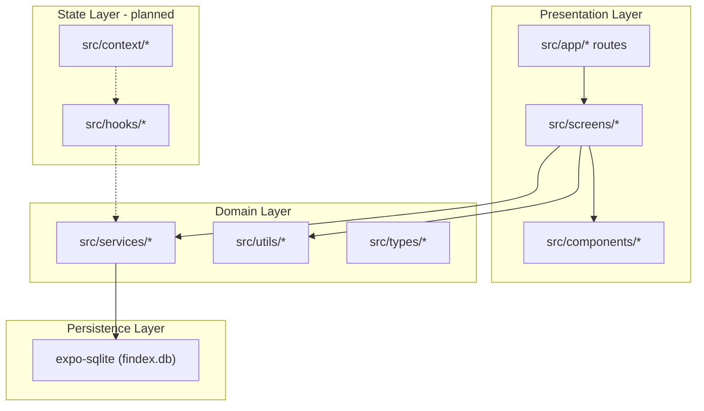
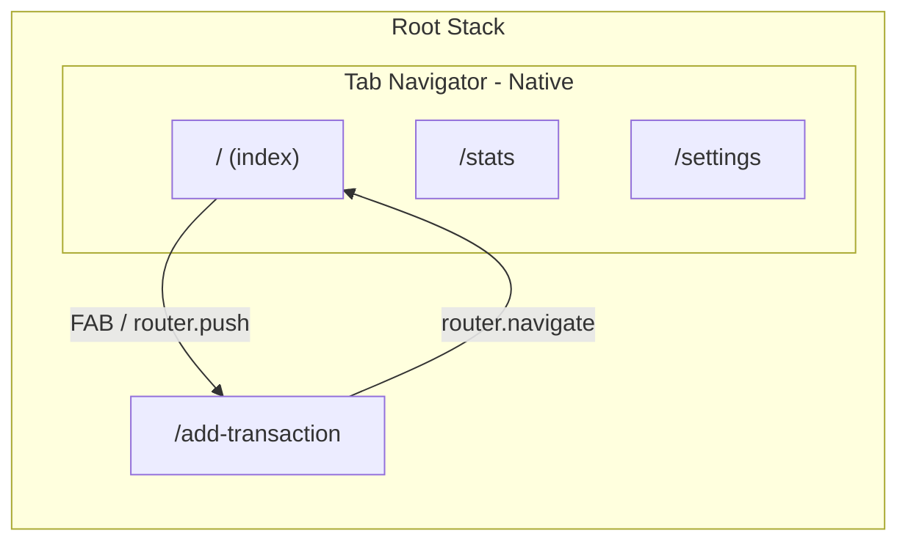
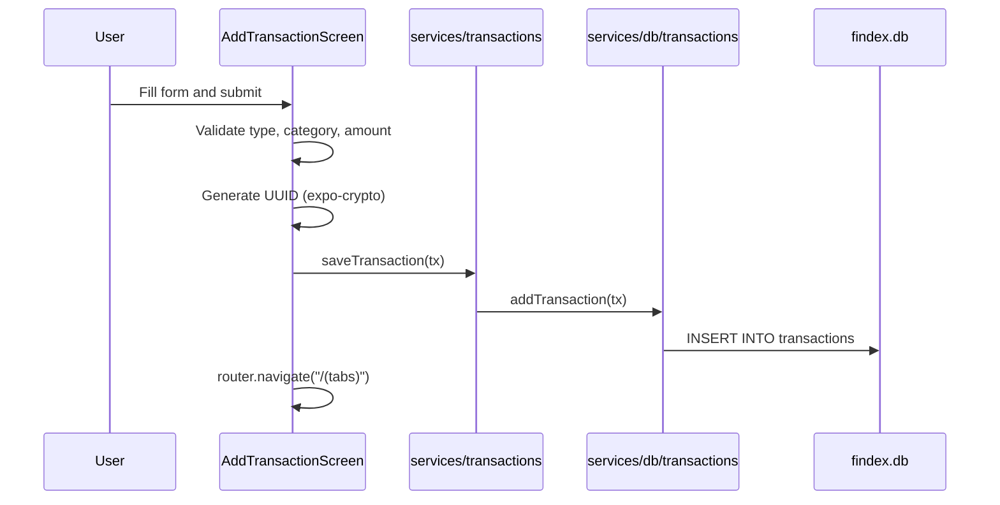
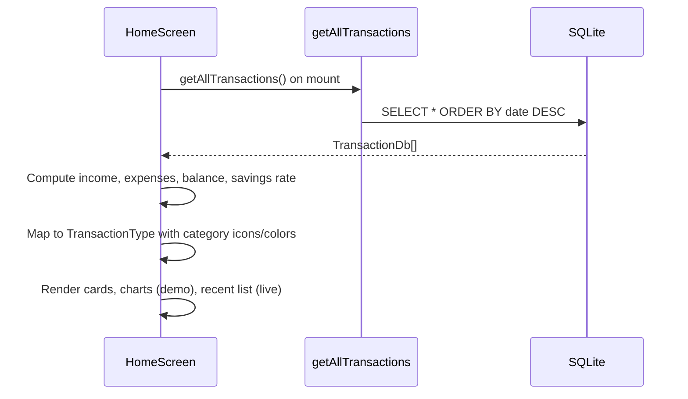

# FinDash Project Architecture

FinDash is a cross-platform personal finance tracker built with **Expo**, **React Native**, and **expo-router**. It lets users record income and expenses, view summary metrics on a dashboard, and (planned) explore trends through charts and settings.

This document describes how the codebase is organized, how data flows through the app, and what is implemented versus planned.

---

## Table of contents

1. [High-level overview](#high-level-overview)
2. [Technology stack](#technology-stack)
3. [Directory structure](#directory-structure)
4. [Application layers](#application-layers)
5. [Navigation and routing](#navigation-and-routing)
6. [Data flow](#data-flow)
7. [Cross-platform strategy](#cross-platform-strategy)
8. [Implementation status](#implementation-status)
9. [Conventions and design decisions](#conventions-and-design-decisions)
10. [Related documentation](#related-documentation)

---

## High-level overview

The app follows a **layered architecture** that separates routing, screens, UI components, business logic, and persistence:



**Current reality:** Screens talk directly to the service layer. Context providers and custom hooks exist as scaffolding but are not yet wired up. See [Implementation status](#implementation-status).

---

## Technology stack

| Layer | Technology |
|-------|------------|
| Framework | Expo SDK 54, React Native 0.81, React 19 |
| Navigation | expo-router 6 (file-based routing, typed routes) |
| Database | expo-sqlite (local SQLite, `findex.db`) |
| Charts | react-native-gifted-charts |
| Icons | @expo/vector-icons (Ionicons) |
| Forms / inputs | react-native-element-dropdown, @react-native-community/datetimepicker |
| IDs | expo-crypto (`randomUUID`) |
| Language | TypeScript (strict mode) |
| Path aliases | `@/*` maps to project root |

Experiments enabled in `app.json`: **typed routes**, **React Compiler**, **New Architecture**.

---

## Directory structure

```
FinDash/
├── assets/images/          # App icons, splash screen, favicon
├── docs/                   # Project documentation
├── src/
│   ├── app/                # expo-router routes (thin wrappers)
│   │   ├── _layout.tsx     # Root stack, DB initialization
│   │   ├── _layout.web.tsx # Web-specific root layout (navbar)
│   │   ├── add-transaction.tsx
│   │   └── (tabs)/
│   │       ├── _layout.tsx       # Bottom tab navigator (native)
│   │       ├── _layout.web.tsx   # Stack layout (web)
│   │       ├── index.tsx         # Home tab → HomeScreen
│   │       ├── index.web.tsx     # Web home placeholder
│   │       ├── home.web.css      # Web-only home styles
│   │       ├── stats.tsx
│   │       └── settings.tsx
│   ├── screens/            # Feature screen implementations
│   ├── components/
│   │   ├── ui/             # Reusable form and layout primitives
│   │   ├── charts/         # Income/expense and category charts
│   │   └── transactions/   # Transaction list and row components
│   ├── context/            # React context providers (scaffolding)
│   ├── hooks/              # Custom hooks (scaffolding)
│   ├── services/
│   │   ├── db/             # Raw SQLite operations
│   │   ├── transactions.ts # Transaction service facade
│   │   └── categories.ts   # Static category registry
│   ├── types/              # Domain TypeScript types
│   └── utils/              # Formatting and stats helpers
├── app.json
├── package.json
└── tsconfig.json
```

---

## Application layers

### 1. Routing (`src/app`)

Routes are **thin entry points**. They delegate to screen components in `src/screens` and configure navigation chrome (headers, tabs).

| Route file | Path | Screen / behavior |
|------------|------|-----------------|
| `(tabs)/index.tsx` | `/` | `HomeScreen` |
| `(tabs)/stats.tsx` | `/stats` | Inline stub (not yet `StatsScreen`) |
| `(tabs)/settings.tsx` | `/settings` | Inline stub (not yet `SettingsScreen`) |
| `add-transaction.tsx` | `/add-transaction` | `AddTransactionScreen` |

The root layout (`_layout.tsx`) initializes the SQLite database on mount via `initDB()` before any screen renders.

### 2. Screens (`src/screens`)

Screens orchestrate user flows: fetch data, compute derived values, compose components, and handle navigation.

| Screen | Status | Responsibility |
|--------|--------|----------------|
| `HomeScreen` | Implemented | Dashboard: balance cards, charts, recent transactions, FAB to add |
| `AddTransactionScreen` | Implemented | Form to create income/expense entries |
| `StatsScreen` | Empty file | Planned: dedicated analytics view |
| `SettingsScreen` | Empty file | Planned: preferences, currency, theme |
| `TransactionDetailsScreen` | Empty file | Planned: view/edit/delete single transaction |

### 3. Components (`src/components`)

Organized by concern:

- **`ui/`** — Generic building blocks: `Button`, `Card`, `InputField`, `DropdownInputField`, `DateInputField`, `Modal`, `SegmentedControl`
- **`charts/`** — `IncomeExpenseChart` (bar), `CategoryPieChart` (donut). Currently use **demo data**; not yet connected to live transactions
- **`transactions/`** — `TransactionList`, `TransactionItem` for rendering recent activity

### 4. Services (`src/services`)

Two-tier service design:

```
Screen → services/transactions.ts → services/db/transactions.ts → SQLite
```

| Module | Role |
|--------|------|
| `services/db/transactions.ts` | Low-level SQLite: `initDB`, `addTransaction`, `getTransactions`, `deleteTransaction` |
| `services/transactions.ts` | Facade: `saveTransaction`, `getAllTransactions` |
| `services/categories.ts` | Static `Categories` map: label, Ionicons icon, color per `CategoryType` |

Database details are documented in [DATA_MODEL.md](./DATA_MODEL.md).

### 5. Types (`src/types`)

| Type | File | Purpose |
|------|------|---------|
| `TransactionDb` | `Transaction.ts` | Shape stored in SQLite (`date` as ISO string) |
| `TransactionType` | `Transaction.ts` | UI-enriched shape (`date` as `Date`, icon, color) |
| `CategoryType` | `Category.ts` | Union of allowed category keys |
| Stats types | `Stats.ts` | Empty — planned for chart/report payloads |

### 6. Context and hooks (planned)

These directories define the **target state management pattern** but are currently empty placeholders:

| Module | Intended role |
|--------|---------------|
| `TransactionsContext` | Global transaction list, CRUD, refresh after mutations |
| `CategoriesContext` | Category metadata access |
| `ThemeContext` | Light/dark mode, currency preference |
| `useTransactions` | Transaction fetch/mutate hooks |
| `useCategories` | Category helpers |
| `useStats` | Aggregated stats for charts |
| `useSQLite` | Database readiness / connection hook |

When implemented, screens should consume hooks instead of calling services directly. This will eliminate duplicate fetches (e.g. `HomeScreen` reloading on every mount) and keep charts in sync with new transactions.

### 7. Utilities (`src/utils`)

| File | Status | Purpose |
|------|--------|---------|
| `formatDate.ts` | Implemented | Formats dates as `Feb 15, 2026` |
| `formatCurrency.ts` | Empty | Planned: locale-aware currency display |
| `calculateStats.ts` | Empty | Planned: income/expense/category aggregations |
| `constants.ts` | Empty | Planned: shared magic numbers and config |

---

## Navigation and routing



**Native (iOS/Android):** Bottom tabs for Home, Stats, Settings. Add Transaction is a modal stack screen pushed from the Home FAB.

**Web:** Custom top navbar in `_layout.web.tsx` replaces bottom tabs. `(tabs)/_layout.web.tsx` uses a flat `Stack` with hidden headers. Home has a separate `index.web.tsx` placeholder with CSS grid layout — not yet sharing logic with `HomeScreen`.

---

## Data flow

### Adding a transaction



### Loading the home dashboard



**Note:** Summary card trend percentages (`12.5% from last month`) are hardcoded placeholders. Charts on Home still render demo datasets.

---

## Cross-platform strategy

| Concern | Native | Web |
|---------|--------|-----|
| Tab navigation | `@react-navigation/bottom-tabs` via expo-router | Top navbar in `_layout.web.tsx` |
| Home screen | `HomeScreen.tsx` (React Native) | `index.web.tsx` (HTML/CSS placeholder) |
| Styling | `StyleSheet` | `home.web.css` for web home; rest uses RN Web |
| SQLite | expo-sqlite (supported on web in Expo) | Same API |
| Platform files | Default `.tsx` | `.web.tsx` overrides |

Platform-specific files follow Expo's resolution order: `index.web.tsx` is used on web instead of `index.tsx` for the home tab.

---

## Implementation status

### Done

- SQLite schema and CRUD for transactions
- Home dashboard with live balance calculations from DB
- Add transaction form with validation
- Category registry with icons and colors
- Transaction list UI with formatted dates
- Reusable UI form components
- Web root layout with navigation bar

### In progress / stubbed

- Stats and Settings tab screens (inline placeholders in routes)
- Chart components (UI complete, demo data only)
- Card trend descriptions (hardcoded percentages)
- Web home page (static HTML/CSS mockup)

### Not started (scaffolding only)

- Context providers and custom hooks
- `StatsScreen`, `SettingsScreen`, `TransactionDetailsScreen`
- `formatCurrency`, `calculateStats`, `constants`
- `Stats.ts` types
- Transaction edit/delete flows
- Month-over-month comparison logic
- Currency and theme preferences

---

## Conventions and design decisions

### Route vs screen split

Keep `src/app` routes minimal — one default export that renders a screen. Navigation config (titles, tab icons) stays in layout files.

### Two transaction types

`TransactionDb` (persistence) and `TransactionType` (presentation) are intentionally separate. The DB stores plain strings; the UI layer enriches records with icons and colors from `Categories`.

### Service facade over raw DB

Screens import from `services/transactions.ts`, not `services/db/transactions.ts`. This leaves room to add caching, validation, or swap storage without touching UI.

### Category as static config

Categories are not stored in SQLite. They are a fixed registry in `services/categories.ts`. Only the category **key** is persisted on each transaction.

### Path alias

Use `@/src/...` imports (configured in `tsconfig.json` as `@/*` → project root).

---

## Related documentation

- [DATA_MODEL.md](./DATA_MODEL.md) — Database schema, types, and category registry
- [DEVELOPMENT.md](./DEVELOPMENT.md) — Local setup, scripts, and contribution guidelines
- [README.md](../README.md) — Project overview and quick start
